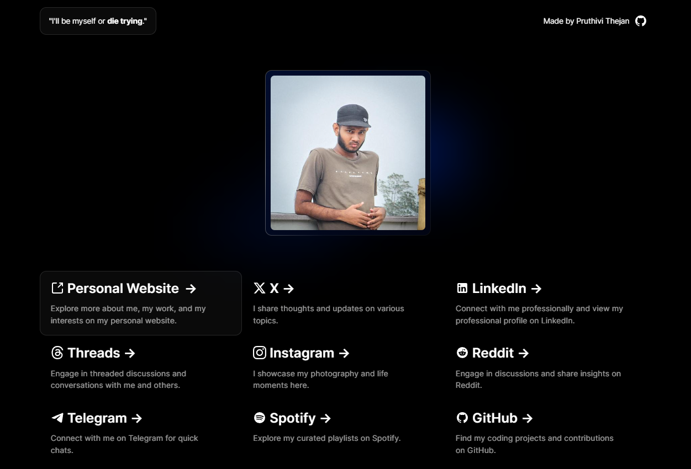

<h1 align="center">Links - Linktree Clone for Developers</h1>



## 📖 Make your own

Prerequisites :

- Install [Git](https://git-scm.com/downloads).
- [Nodejs](https://nodejs.org/en/) and [pnpm(recommended)](https://pnpm.io/installation) installed.

Steps :

- Clone the repository, install the dependencies and start the application.

```bash
git clone https://github.com/pruthivithejan/links.git
cd links
pnpm install
pnpm run dev
```

This will start the project on your `localhost:3000`. Open the browser and see if it works.

- All you have to do is go to the `content.ts` file and replace everything with your information.


```typescript
export const codeRepository = "linktree"; //This is pointed to this repository, if you fork your own you can point to that or leave this as it is.
export const githubUsername = "pruthivithejan"; //*Required because the site will pull your Github avatar and use it on the website.
export const heading = "Pruthivi Thejan | Linktree"; //This is the heading that shows in the browser tab.
export const slogan = {
  words: "I'll be myself or", //This is the slogan, put whatever you like.
  hightlight: "die trying", //This part of the slogan will be highlighted.
};

export const Cards = [
{
href: "https://mobile.twitter.com/pruthivithejan", //Change the link here to your liking.
icon: "twitter", //Please check if the `public/` folder has the SVG to your link or place a one yourself, It must be a .svg file.
title: "Twitter", //Change the title to your liking.
description: "I care about Twitter, I hope Elon Musk will not ruin it.", //Change the description to your liking.
}, //...add more

```

- Save, come back and see if the changes are made.

- If you want any new Icons add them to `public` folder as SVGs. You can find SVG Icons [here](https://icon-sets.iconify.design/).

- Deploying is automatically set to GitHub Pages

✨ Leave a Star on the repository if you like. ✨ <br>

## 📄 License

[MIT](./LICENSE.md) &copy; [Pruthivi Thejan](https://pruthivithejan.me/)
